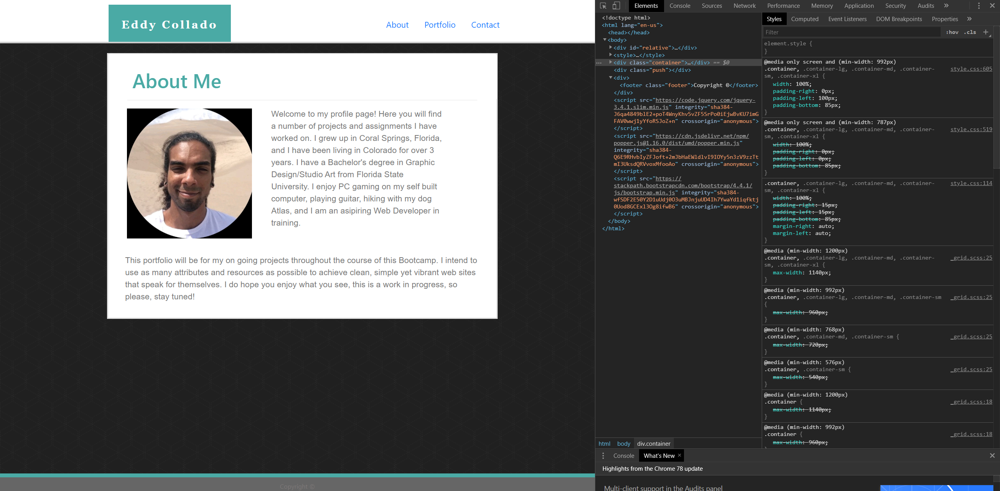
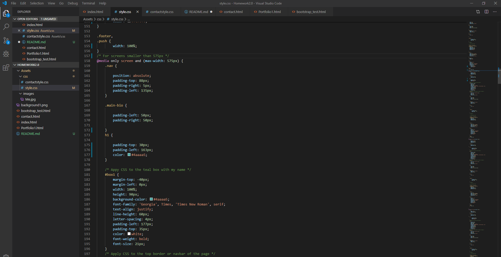

For this homework assignment, we were tasked to create our portfolio reusing the first homework assignment and apply responsive design in multiple breakpoints. The following shows the process of shaping my current website to fill the needs of different rendering devices.

# Homework 2: Responsive Design

## Developer Tools: Mans best friend

Using Chrome Developer Tools, I was able to utilize reverse engineering to achieve desired results much easier. Im very excited to start taking this to the next level with something unique.

## CSS sample

The most difficult part of this assignment has to be making sure the media queries arent conflicting with each other. There was a lot of back and forth but it was necessary and helped me understand the importance of organizing and cleaning up your code.

